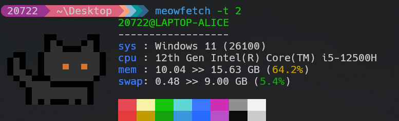
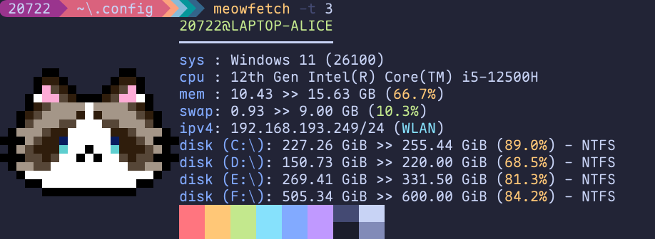
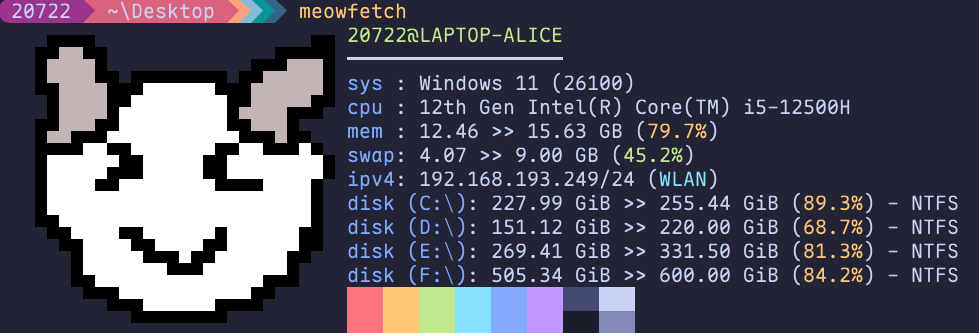

# Meowfetch

Meowfetch is a simple and lightweight system information tool written in Rust. It displays various system details such as the operating system, kernel version, hostname, username, cpu, memory and swap usage, ip address, and more.

## Installation

To install Meowfetch, simply clone the repository and build it using Cargo:
```bash
git clone https://github.com/Snape-max/meowfetch.git
cd meowfetch
cargo install --path .
```

Alternatively, you can download a pre-compiled binary from the [releases page](https://github.com/Snape-max/meowfetch/releases).

## Usage

To run Meowfetch, simply type `meowfetch` in your terminal.
Here is an example output of Meowfetch:


You can also use the `-t` flag to display another type of cat logo.






## Customization

You can customize the Logo of Meowfetch by modifying the `.meowrc` file at `$HOME/.config/.meowrc`, by [this tool](https://github.com/Snape-max/terminal_art_creator).


Just draw the logo on the website and touch the export button to copy the string and then paste it to the `.meowrc` file. 


Then run `meowfetch` to see the changes.




## Contributing

Contributions are welcome! If you find a bug or have a feature request, please open an issue on the GitHub repository. If you want to contribute code, please fork the repository and submit a pull request.

## License

Meowfetch is licensed under the MIT License. See the [LICENSE](https://github.com/Snape-max/meowfetch/blob/main/LICENSE) file for more information.


