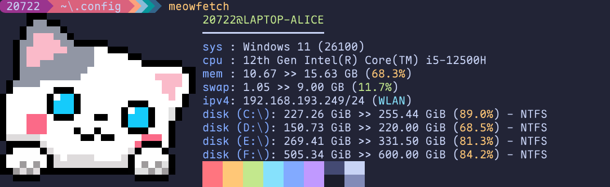
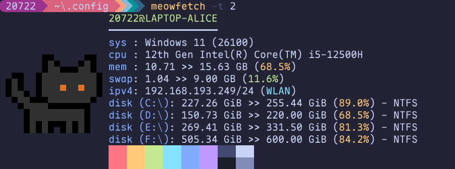

# Meowfetch

Meowfetch is a simple and lightweight system information tool written in Rust. It displays various system details such as the operating system, kernel version, hostname, username, CPU, memory and swap usage.

## Installation

To install Meowfetch, simply clone the repository and build it using Cargo:
```bash
git clone https://github.com/Snape-max/meowfetch.git
cd meowfetch
cargo install --path .
```

Alternatively, you can download a pre-compiled binary from the [releases page](https://github.com/Snape-max/meowfetch/releases).

## Usage

To run Meowfetch, simply type `meowfetch` in your terminal.
Here is an example output of Meowfetch:




You can also use the `-t` flag to display another type of cat logo.




## Contributing

Contributions are welcome! If you find a bug or have a feature request, please open an issue on the GitHub repository. If you want to contribute code, please fork the repository and submit a pull request.

## License

Meowfetch is licensed under the MIT License. See the [LICENSE](https://github.com/Snape-max/meowfetch/blob/main/LICENSE) file for more information.


